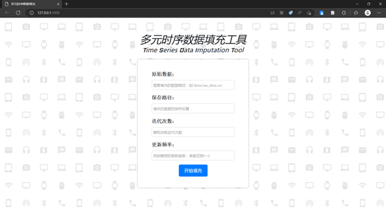
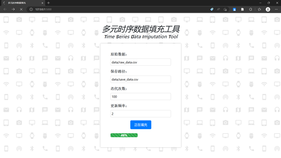
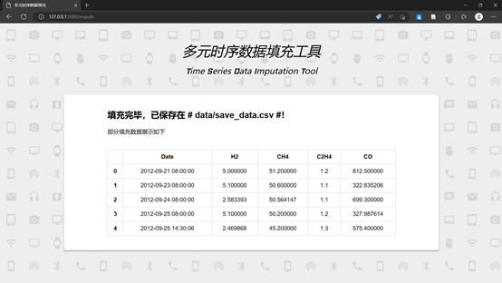

# Conv_WGAIN_for_MTI

## Overview
This tool is a multi-variate time series data imputation tool developed based on the Conv_WGAIN model. The model imputation principle is that the generator learns from the distribution of existing data, and then generates data to fill in the missing parts of the data, so that the discriminator cannot identify the real data and the generated data. The paper of this model has been accepted and published by the Chinese core journal Computer Science and Engineering. This tool uses the Flask framework to write a WEB-based imputation tool that can impute missing values for any multi-variate time series data. The Conv_WGAIN model used to fill data is not a pre-trained model, because this model runs extremely fast, which also makes this tool widely applicable to different datasets.

## Dependencies
- Python 3.8.13
- Pandas 1.4.4
- Flask 2.3.1
- NumPy 1.21.5
- PyTorch 1.12.1

## Usage
1. Enter the project directory and run the following command to install the environment dependencies
    ~~~shell
    cd path/to/Conv_WGAIN_for_MTI
    pip install -r requirements.txt
    ~~~
2. Run the flask_web.py script to start the flask server
    ~~~shell
    python flask_web.py
    ~~~
3. Open [http://127.0.0.1:5000/](http://127.0.0.1:5000/) in your browser to launch the imputation tool. The center box on the imputation tool page is used to enter some necessary parameter information. "Original Data" refers to the location of the original data with missing values, it is recommended to copy the data to the 'data' folder under the project. "Save Path" refers to where the data will be saved after imputation. "Number of Epochs" refers to the number of iterations the model will train. "Update Frequency" refers to how many batches of data the discriminator will be updated after each training, this value is usually between 1-5. To guide the user, corresponding prompt words are set in the text box.

    
    
4. After filling in the relevant parameters, click the "Start Imputing" button to start imputation. During imputation, a progress bar will appear below the button to indicate the imputation progress, and to prevent the user from clicking the button again, the clickable property of the cancel button will be disabled. In addition, when the mouse hovers over the button, the mouse cursor will change to disabled to indicate to the user.

    

5. After imputation is complete, it will jump to the result page. Inform the user of the save path of the data, and display some of the data to the user to see the imputation effect.

    

## Citation
If you find this work helpful, please consider citing the paper
~~~BibTex
@article{{0},
 author = {刘子建,丁维龙,邢梦达,李寒 &amp; 黄晔},
 title = {Conv-WGAIN:面向多元时序数据缺失的卷积生成对抗插补网络模型},
 journal = {计算机工程与科学},
 volume = {45},
 number = {931-939},
 year = {2023},
 issn = {1007-130X}
 }
~~~